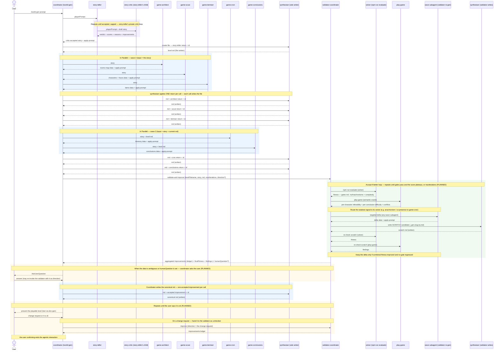
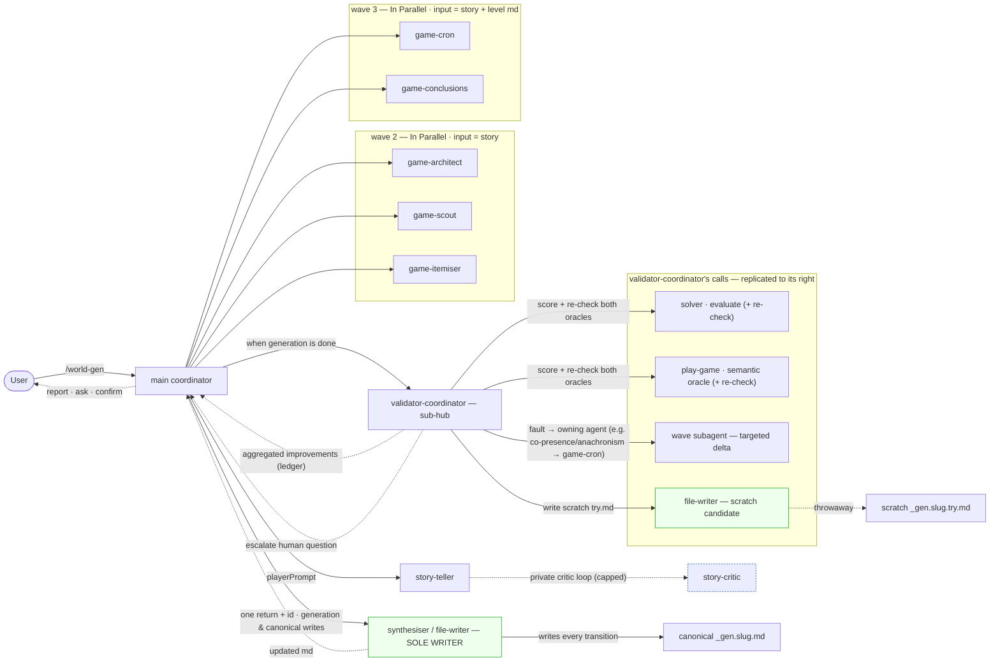

# HLD: world-gen Agentic Call Graph

## Status

**Living document.** Started 2026-06-14 on the `world-gen` branch. Tracks the agentic
request/delegation flow of the `/world-gen` generative level generator — who calls whom, what is
passed and returned, which calls are LLM subagents vs deterministic steps, and which run in parallel.
The *why* (design, fitness model, roadmap) lives in the sibling
[world-gen-generative-level-design.md](world-gen-generative-level-design.md); the exact per-agent
input/output structures live in
[../../.claude/skills/world-gen/references/agent-contracts.md](../../.claude/skills/world-gen/references/agent-contracts.md).
This document is the *how-it-calls* view.

## How to use & maintain

Keep this reflecting the **calls that actually happen**. **Whenever an agent call changes — a new/
removed/merged agent, a changed payload, a new delegation, a changed parallel grouping, or a call
promoted PLANNED→LIVE — update the diagrams, the [call table](#call-table), and the
[Changelog](#changelog) in the same change.** Keep PLANNED visibly separate from LIVE.

## Legend

- **subagent** — a *pure* LLM agent: minimal custom input, returns a custom structure ending in a
  `prompt` field, and **never writes files**.
- **synthesiser** — the **only** agent that creates/updates the level md (applies one subagent return
  per call, writing the file each time).
- **coordinator / validator-coordinator** — the two hubs (see invariants).
- **deterministic** — a non-LLM step (a Bash/CLI call, e.g. the solver); no model.
- **LIVE** = wired in the skill today. **PLANNED** = designed, not yet wired.

**Layout convention.** The diagrams read **left → right**: a caller is always to the **left** of its
callee, so a **solid arrow is a forward request and always points rightward**. A hub's callees are
drawn to the hub's right — and because the **validator-coordinator** is itself a hub that calls agents,
**its callees are replicated to its right** (the validator-side solver, play-game, re-gen subagent, and
synthesiser are distinct nodes from the main coordinator's, on the validator's right). **Dashed arrows**
are returns, escalations, or human-facing prompts back toward a hub/the user (rightward replies are the
hub passing data down). Parallel groups and loops are shown as **shaded regions with a full-English
label** — no bare Mermaid keyword tabs (`par`/`loop`/`opt`).

---

## Communication rules (invariants)

1. **Hub-and-spoke; no lateral calls.** Subagents are invoked by, and return to, a coordinator. **No
   subagent calls a sibling subagent** — no peer/`subagent↔subagent` edges. All cross-cutting
   coordination flows through a coordinator. The graph stays a **tree**.
2. **Two coordinators (vertical sub-delegation, now used).** The **main coordinator** is the top hub.
   The **validator-coordinator** is a sub-hub it spawns (the DR-011 "vertical sub-delegation" pattern,
   now actively used): it delegates to the same wave subagents + the synthesiser, and routes any
   human-input request **up** to the main coordinator (which asks the user and passes the answer back
   down). Subagents may also have their own private deeper helpers — the **story-teller → story-critic**
   loop (below) is the first realized case.
3. **The synthesiser is the sole writer (DR-012).** Subagents are *pure* — they return data + an apply
   `prompt`; only the synthesiser creates/updates `public/levels/_gen.<slug>.md`. It applies **one**
   subagent return per call and **writes the file every call**, so every transitional state is
   testable live via `npm run dev-gen`.
4. **Independent subagents run in parallel (DR-013).** Subagents that need the *same* input (and not a
   prior modified md) are spawned concurrently; the synthesiser then applies their returns **one at a
   time** (serialized writes).
5. **Human-in-the-loop terminates the run (DR-014).** The validator-coordinator caps the automated
   tweak loop; final termination is the human's: the user tests each written state and the interaction
   ends only when they confirm ("it's ok").

---

## Request flow

## Delegation graph

---

## Call table

| # | Caller | Callee | Kind | Sends | Returns | Parallel? | Status |
|---|---|---|---|---|---|---|---|
| 1 | User | main coordinator | invocation | player prompt | report / confirm prompt | — | LIVE |
| 2 | coordinator | story-teller | subagent | `playerPrompt` | `story` + apply-prompt | solo (wave 1) | LIVE |
| 2a | story-teller | story-critic | subagent (**private child**) | `playerPrompt` + draft story | verdict + scores + reasons + improvements | looped (capped) | LIVE |
| 3 | coordinator | synthesiser | synthesiser | md(null) + story-teller return + id | level md (writes file) | serialized | LIVE |
| 4 | coordinator | game-architect | subagent | `story` | rooms/map data + prompt | **In Parallel (wave 2)** | LIVE |
| 5 | coordinator | game-scout | subagent | `story` | characters/faces data + prompt | **In Parallel (wave 2)** | LIVE |
| 6 | coordinator | game-itemiser | subagent | `story` | items data + prompt | **In Parallel (wave 2)** | LIVE |
| 7 | coordinator | game-cron | subagent | `story` + level md | itinerary data + prompt | **In Parallel (wave 3)** | LIVE |
| 8 | coordinator | game-conclusions | subagent | `story` + level md | conclusions data + prompt | **In Parallel (wave 3)** | LIVE |
| 9 | coordinator | synthesiser | synthesiser | md + one subagent return + id | level md (writes file) | once per return (serialized) | LIVE |
| 10 | coordinator | validator-coordinator | subagent (sub-hub) | levelFilename + story + current md + maxIterations + direction? | improvements ledger + finalFitness + play-game findings (+ humanQuestion) | — | PLANNED |
| 11 | validator-coordinator | `npm run evaluate` | deterministic | candidate file (canonical or scratch) | fitness JSON (gates incl. `noAnachronisms` + complexity) | per iteration — baseline & re-check | PLANNED |
| 12 | validator-coordinator | play-game | subagent (semantic oracle) | candidate file | structured per-character inferability + per-conclusion difficulty + conflicts | per iteration — baseline & re-check | PLANNED |
| 13 | validator-coordinator | any wave subagent | subagent | targeted directive (fault → owning agent; e.g. co-presence / anachronism → game-cron) | delta data + prompt | as applicable | PLANNED |
| 14 | validator-coordinator | file-writer (synthesiser) | synthesiser | md + delta + **scratch** target | scratch md (writes `_gen.slug.try.md`) | serialized | PLANNED |
| 15 | validator-coordinator | coordinator | up-call | `humanQuestion` / aggregated improvements | user's answer / proceed | — | PLANNED |
| 16 | coordinator | Human | `AskUserQuestion` | question (on `humanQuestion` / ambiguity) | answer / "it's ok" (ends run) | — | PLANNED |
| 17 | coordinator | file-writer (synthesiser) | synthesiser | **canonical** md + one accepted improvement + id | canonical md (writes `_gen.slug.md`, each transition) | once per improvement | PLANNED |

---

## Current-state notes

- **Only the synthesiser writes.** Every other agent is pure (data + apply-`prompt`); the synthesiser
  resolves cross-references (owner→character id, `activeCharacter`→id, cloze answer→title) as it
  applies each return, and writes the file each call. See
  [agent-contracts.md](../../.claude/skills/world-gen/references/agent-contracts.md).
- **Vertical sub-delegation (now used).** The story-teller runs a private **story-critic** loop (its
  own child, capped) before returning — the first realized vertical sub-delegation. The critic is pure
  (scores + advice; no file writes) and is invisible to the coordinator.
- **Parallel groups.** Wave 2 = {architect, scout, itemiser} (all take only the `story`); wave 3 =
  {cron, conclusions} (both take `story` + the integrated md, neither depends on the other). story-
  teller is solo (root). The synthesiser is inherently **serialized** (one return per call).
- **Validator-coordinator is PLANNED (dual-oracle, accept-if-better — DR-017).** It scores each
  candidate with **both** oracles (solver + the **play-game** semantic oracle subagent), routes each
  failing gate / weak signal to the **agent that owns that area** (table in the call section / contracts),
  tests every proposed delta on a **scratch** `_gen.slug.try.md` (written by the file-writer), and
  **keeps it only if combined fitness improves with no gate regression**. It **returns the aggregated
  accepted-improvement ledger** to the main coordinator and **never writes the canonical md**. The
  **coordinator** then writes the canonical file via the **file-writer** (one accepted improvement per
  call) and **asks the user** when the validator returns a `humanQuestion` or ambiguous data. Today the
  main coordinator runs this loop inline (≤ maxIterations); a separately-spawned validator-coordinator
  agent is the next build (Phase 2–4).
- **Exercise status.** The revised model has been exercised **through waves 1–3** (Sing a Song of
  Sixpence, 2026-06-14): the story-teller→story-critic loop, the **In-Parallel** waves 2 and 3, pure
  subagent returns, and the synthesiser all ran; the level loads with the full Identities + cloze
  puzzle, and movement-based co-presence works. The far-room link that first read as an open finding was
  a **solver** blind spot (a tour's final room was never sampled), now **fixed** (DR-016): the level is
  fully solvable — **6/6 characters, 8/8 items**, `meanCost 0.60`, zero anachronisms. **Not yet
  exercised:** the dedicated validator-coordinator loop and the human-in-the-loop. The earlier *full*
  runs (Three Blind Mice, Tinker Tailor Soldier Spy) predate this architecture (prior whole-md model).
- **Anachronism gate (new).** The solver now also detects **timeline anachronisms** (a character in two
  places at once — an absolute arrival back-planned over an earlier one); `npm run evaluate` exposes it
  as the `noAnachronisms` gate + an `anachronisms` detail list, so the validator-coordinator routes such
  a fault to **game-cron** (the itinerary owner). See design-doc DR-016 + adr-solver §6c.
- **Synthesiser is currently fulfilled inline.** In runs so far the **coordinator performs the
  synthesiser role itself** (writing the file as it applies each return); a *dedicated synthesiser
  agent* is the target — same status as the validator-coordinator (designed, not yet a separately
  spawned agent). The sole-writer invariant still holds: nothing but the synthesiser role writes the md.

## Changelog

- **2026-06-14** — Document created (Phase-1 LIVE call graph + PLANNED play-game/optimizer/human calls).
- **2026-06-14** — Made the hub-and-spoke invariant explicit (no lateral calls; vertical sub-delegation
  allowed).
- **2026-06-14** — **Revised architecture:** subagents are now *pure* (minimal custom inputs; return
  data + an apply-`prompt`); a **synthesiser** is the sole writer of the level md (one return per call,
  writes every transition); independent subagents run in **parallel** (wave 2 = architect/scout/
  itemiser; wave 3 = cron/conclusions); a **validator-coordinator** sub-hub owns the capped solver/
  play-game tweak loop and routes human-input up to the main coordinator; the run ends on human
  confirmation. Diagrams, call table, and invariants rewritten; per-agent IO moved to
  `agent-contracts.md`. (Design doc DR-012/013/014.)
- **2026-06-14** — Added the **story-critic** (story-teller's private child): the story-teller now runs
  a capped critic loop and returns only a critic-accepted story — the first realized **vertical
  sub-delegation**. (Design doc DR-015.)
- **2026-06-14** — Exercised the revised model through **waves 1–2** (Sing a Song of Sixpence): the
  story-critic loop, parallel wave 2, and pure returns all worked; the synthesiser-applied wave-2 state
  loads. Recorded that the **synthesiser is currently fulfilled inline by the coordinator** (dedicated
  agent still pending), and that wave 3 / validator-coordinator / human-loop remain un-exercised.
- **2026-06-14** — Exercised **wave 3** (cron ∥ conclusions): the level loads with the full puzzle and
  movement-based co-presence works (depth 0.38); a far-room link is an open solver finding. Updated
  exercise status to **waves 1–3** (no un-exercised waves remain). Relabelled the parallel blocks
  explicitly **"In Parallel"** (the bare Mermaid `par` keyword stays — it's required syntax — but every
  grouping's visible label now reads "In Parallel").
- **2026-06-14** — Solver-side update (DR-016): the far-room "open finding" was a co-presence
  **sampling** blind spot, now fixed (timeline-end sample) — the level is fully solvable (6/6 chars, 8/8
  items, `meanCost 0.60`). Added the **anachronism** signal to the validator's `evaluate` return
  (`noAnachronisms` gate) and noted the fault routes to **game-cron**.
- **2026-06-14** — **Diagrams reoriented left → right.** Both the sequence and delegation diagrams now
  read caller-on-left, callee-on-right; the **validator-coordinator's callees are replicated to its
  right** (EV/PG/VR/SY2 as distinct nodes). Flowchart switched to `flowchart LR`. **Removed every bare
  Mermaid keyword tab** (`par`/`loop`/`opt`) in the sequence diagram — parallel groups and loops are now
  **shaded `rect` regions with a full-English label** ("In Parallel …", "Repeats until …", "When a fix is
  needed …"). Solid arrow = forward request (always rightward); dashed = return / escalation / human
  prompt. (Supersedes the prior "the `par` keyword stays" note.)
- **2026-06-14** — **Validator-coordinator wired as a dual-oracle accept-if-better loop (DR-017).** Both
  diagrams now show the validator scoring with the **solver and the play-game semantic oracle**, routing
  a fault to its owning agent for a **targeted delta**, writing a **scratch** `_gen.slug.try.md` via the
  file-writer, **re-checking with both oracles**, and keeping the delta only if it improves with no gate
  regression. It **returns the aggregated improvement ledger** to the coordinator (no canonical write);
  the **coordinator asks the user** on `humanQuestion`/ambiguity, then **writes the canonical md via the
  file-writer** (one accepted improvement per call). Call table rows 10–17 + the validator note updated.
