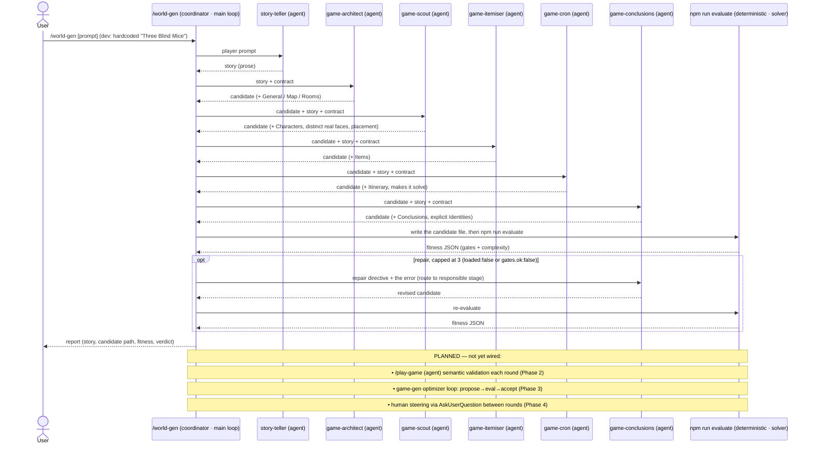
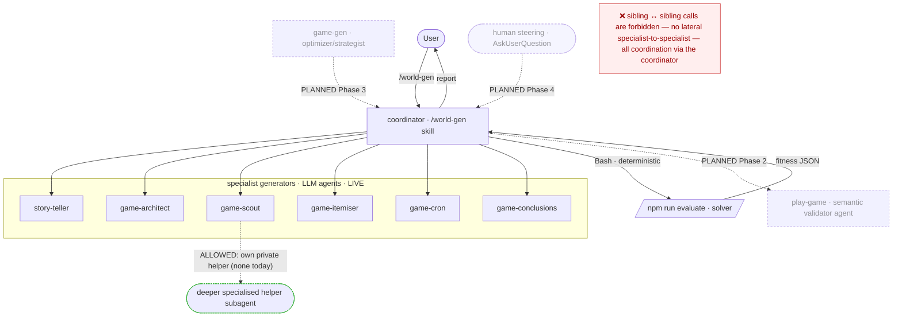

# HLD: world-gen Agentic Call Graph (current state)

## Status

**Living document.** Started 2026-06-14 on the `world-gen` branch. Tracks the **current-state**
agentic request/delegation flow of the `/world-gen` generative level generator — who calls whom, what
is passed and returned, and which calls are LLM sub-agents vs deterministic steps. The *why* (design,
fitness model, roadmap) lives in the sibling [world-gen-generative-level-design.md](world-gen-generative-level-design.md);
this document is the *how-it-calls* view.

## How to use & maintain

This HLD must always reflect the **calls that actually happen now**. **Whenever an agent call changes —
a new sub-agent, a removed/merged stage, a changed payload, a new inter- or intra-agent delegation, or
a call promoted from PLANNED to LIVE — update the diagrams, the [call table](#call-table), and the
[Changelog](#changelog) in the same change.** Keep PLANNED items visibly separated from LIVE ones so a
reader can trust the diagram as the present reality, not the aspiration.

## Legend

- **agent** — an LLM sub-agent spawned via the Agent tool (its own context; returns text/structured
  output).
- **deterministic** — a non-LLM step the coordinator runs directly (a Bash/CLI call); no model.
- **coordinator** — the main-loop Claude executing the `/world-gen` skill. It is not a spawned agent;
  it *is* the agent the user talks to, and it does all delegation.
- **LIVE** = wired today. **PLANNED** = specified in the design doc, not yet wired.

---

## Communication rules (invariants)

These are **architectural invariants**, not just the present wiring:

1. **Hub-and-spoke — the coordinator is the only hub.** Every specialist subagent is invoked by, and
   returns to, the coordinator. **No specialist ever calls a sibling specialist** — there are *no
   lateral / peer / subagent↔subagent calls*. All cross-specialist coordination, sequencing, and shared
   state (the story, the candidate Markdown, validation results) flow **through the coordinator**. This
   is what "no intra-agent calls" means here.
2. **Vertical sub-delegation is allowed.** A specialist *may* spawn its own deeper, more-specialised
   subagents to complete the specific task the coordinator assigned it. Such children are **private to
   that parent specialist** — they serve and report back only to it, and their results roll up into the
   parent's single return to the coordinator. They must **not** reach across to other specialists, to
   the coordinator's other concerns, or to shared validation.
3. **Why:** one hub keeps the call graph a **tree** (no peer mesh), makes every cross-cutting decision
   observable in one place (the coordinator's transcript + ledger), and lets a specialist be improved
   or internally decomposed without any other specialist depending on its internals.

So the graph is a **tree rooted at the coordinator**: coordinator → specialists (LIVE), and optionally
specialist → its own private helper subagents (ALLOWED; none today). Sibling↔sibling edges never exist.

---

## Request flow (current state)

The user invokes `/world-gen`; the coordinator runs the Phase-1 one-shot pipeline, spawning each
specialist in sequence (each receives the story + the candidate-so-far + the authoring contract and
returns the full updated candidate), then validates deterministically.

## Delegation graph (current state)

---

## Call table

| # | Caller | Callee | Kind | Sends | Returns | Sync | Status |
|---|---|---|---|---|---|---|---|
| 1 | User | `/world-gen` (coordinator) | invocation | player prompt (dev: hardcoded) | final report | sync | **LIVE** |
| 2 | coordinator | story-teller | agent | player prompt | `story` (prose) | await | **LIVE** |
| 3 | coordinator | game-architect | agent | story + contract | candidate (+ General/Map/Rooms) | await | **LIVE** |
| 4 | coordinator | game-scout | agent | candidate + story + contract | candidate (+ Characters, faces) | await | **LIVE** |
| 5 | coordinator | game-itemiser | agent | candidate + story + contract | candidate (+ Items) | await | **LIVE** |
| 6 | coordinator | game-cron | agent | candidate + story + contract | candidate (+ Itinerary) | await | **LIVE** |
| 7 | coordinator | game-conclusions | agent | candidate + story + contract | candidate (+ Conclusions) | await | **LIVE** |
| 8 | coordinator | `npm run evaluate` | deterministic (Bash) | candidate file path | fitness JSON | sync | **LIVE** |
| 9 | coordinator | responsible stage (often game-conclusions / game-cron) | agent | repair directive + error | revised candidate | await | **LIVE** (≤3) |
| 10 | coordinator | `/play-game` | agent | candidate | per-character inferability + difficulty + gaps | await | PLANNED (Phase 2) |
| 11 | game-gen (optimizer) | coordinator | agent | mutation directives | scored candidate | await | PLANNED (Phase 3) |
| 12 | coordinator | Human | `AskUserQuestion` | round objective options | chosen objective | sync | PLANNED (Phase 4) |

---

## Current-state notes

- **No lateral calls — ever (invariant).** A specialist never calls a sibling specialist; all
  cross-specialist communication routes through the coordinator (see
  [Communication rules](#communication-rules-invariants)). This is a permanent rule, not a "not yet".
- **Vertical sub-delegation is allowed but currently unused.** A specialist *may* spawn its own private
  deeper subagents for its task; today none do — every specialist (calls #2–#7) is a leaf. If a
  specialist starts using private helpers, add that sub-tree here (it still returns only through the
  coordinator, and never reaches a sibling).
- **Validation is deterministic, not an agent.** Call #8 (`npm run evaluate`) is a CLI/solver step, so
  the structural verdict is reproducible and model-free. The *semantic* validator (`/play-game`, #10)
  is an agent and is still PLANNED.
- **Bring-up caveat.** The only end-to-end run to date (the Three Blind Mice demo) used story-teller +
  a single **combined builder** agent rather than the four separate architect/scout/itemiser/cron
  calls, for first-pass coherence (see the design doc's Iteration History). The 6-stage decomposition
  above is the skill's defined current pipeline; expect it to be exercised as full runs happen, and
  update this HLD if the realized topology differs.
- **Payload shape.** Specialists currently exchange the **whole candidate Markdown** (not diffs) for
  simple assembly; the coordinator persists it to `public/levels/_gen.<slug>.md` between the build and
  the validate calls.

## Changelog

- **2026-06-14** — Document created. Captures the Phase-1 LIVE call graph (coordinator → story-teller,
  game-architect, game-scout, game-itemiser, game-cron, game-conclusions → deterministic `evaluate`,
  with ≤3 repair calls) and the PLANNED play-game / game-gen / human-steering calls.
- **2026-06-14** — Made the communication invariant explicit: hub-and-spoke, **no lateral
  subagent↔subagent calls** (all coordination via the coordinator); **vertical sub-delegation** (a
  specialist's own private deeper subagents) is allowed but currently unused. Added a Communication
  rules section and the allowed/forbidden patterns to the delegation graph.
