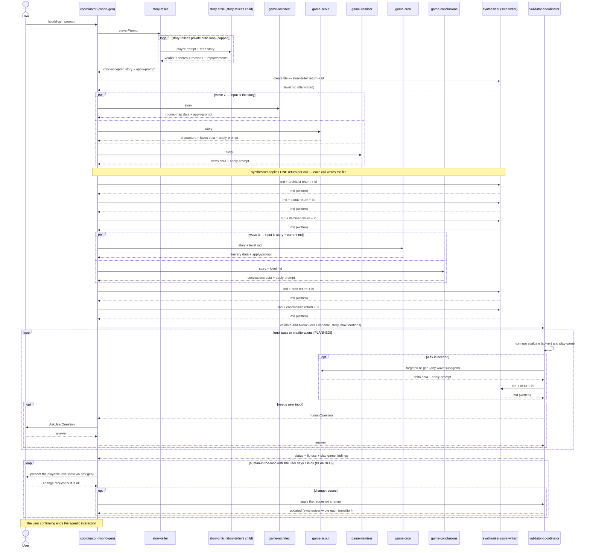
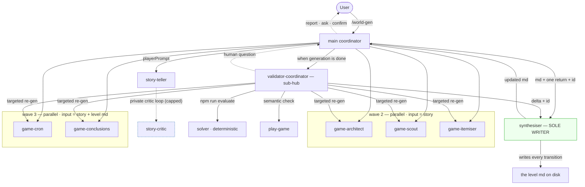

# HLD: world-gen Agentic Call Graph

## Status

**Living document.** Started 2026-06-14 on the `world-gen` branch. Tracks the agentic
request/delegation flow of the `/world-gen` generative level generator — who calls whom, what is
passed and returned, which calls are LLM subagents vs deterministic steps, and which run in parallel.
The *why* (design, fitness model, roadmap) lives in the sibling
[world-gen-generative-level-design.md](world-gen-generative-level-design.md); the exact per-agent
input/output structures live in
[../../.claude/skills/world-gen/references/agent-contracts.md](../../.claude/skills/world-gen/references/agent-contracts.md).
This document is the *how-it-calls* view.

## How to use & maintain

Keep this reflecting the **calls that actually happen**. **Whenever an agent call changes — a new/
removed/merged agent, a changed payload, a new delegation, a changed parallel grouping, or a call
promoted PLANNED→LIVE — update the diagrams, the [call table](#call-table), and the
[Changelog](#changelog) in the same change.** Keep PLANNED visibly separate from LIVE.

## Legend

- **subagent** — a *pure* LLM agent: minimal custom input, returns a custom structure ending in a
  `prompt` field, and **never writes files**.
- **synthesiser** — the **only** agent that creates/updates the level md (applies one subagent return
  per call, writing the file each time).
- **coordinator / validator-coordinator** — the two hubs (see invariants).
- **deterministic** — a non-LLM step (a Bash/CLI call, e.g. the solver); no model.
- **LIVE** = wired in the skill today. **PLANNED** = designed, not yet wired.

---

## Communication rules (invariants)

1. **Hub-and-spoke; no lateral calls.** Subagents are invoked by, and return to, a coordinator. **No
   subagent calls a sibling subagent** — no peer/`subagent↔subagent` edges. All cross-cutting
   coordination flows through a coordinator. The graph stays a **tree**.
2. **Two coordinators (vertical sub-delegation, now used).** The **main coordinator** is the top hub.
   The **validator-coordinator** is a sub-hub it spawns (the DR-011 "vertical sub-delegation" pattern,
   now actively used): it delegates to the same wave subagents + the synthesiser, and routes any
   human-input request **up** to the main coordinator (which asks the user and passes the answer back
   down). Subagents may also have their own private deeper helpers — the **story-teller → story-critic**
   loop (below) is the first realized case.
3. **The synthesiser is the sole writer (DR-012).** Subagents are *pure* — they return data + an apply
   `prompt`; only the synthesiser creates/updates `public/levels/_gen.<slug>.md`. It applies **one**
   subagent return per call and **writes the file every call**, so every transitional state is
   testable live via `npm run dev-gen`.
4. **Independent subagents run in parallel (DR-013).** Subagents that need the *same* input (and not a
   prior modified md) are spawned concurrently; the synthesiser then applies their returns **one at a
   time** (serialized writes).
5. **Human-in-the-loop terminates the run (DR-014).** The validator-coordinator caps the automated
   tweak loop; final termination is the human's: the user tests each written state and the interaction
   ends only when they confirm ("it's ok").

---

## Request flow

## Delegation graph

---

## Call table

| # | Caller | Callee | Kind | Sends | Returns | Parallel? | Status |
|---|---|---|---|---|---|---|---|
| 1 | User | main coordinator | invocation | player prompt | report / confirm prompt | — | LIVE |
| 2 | coordinator | story-teller | subagent | `playerPrompt` | `story` + apply-prompt | solo (wave 1) | LIVE |
| 2a | story-teller | story-critic | subagent (**private child**) | `playerPrompt` + draft story | verdict + scores + reasons + improvements | looped (capped) | LIVE |
| 3 | coordinator | synthesiser | synthesiser | md(null) + story-teller return + id | level md (writes file) | serialized | LIVE |
| 4 | coordinator | game-architect | subagent | `story` | rooms/map data + prompt | **∥ wave 2** | LIVE |
| 5 | coordinator | game-scout | subagent | `story` | characters/faces data + prompt | **∥ wave 2** | LIVE |
| 6 | coordinator | game-itemiser | subagent | `story` | items data + prompt | **∥ wave 2** | LIVE |
| 7 | coordinator | game-cron | subagent | `story` + level md | itinerary data + prompt | **∥ wave 3** | LIVE |
| 8 | coordinator | game-conclusions | subagent | `story` + level md | conclusions data + prompt | **∥ wave 3** | LIVE |
| 9 | coordinator | synthesiser | synthesiser | md + one subagent return + id | level md (writes file) | once per return (serialized) | LIVE |
| 10 | coordinator | validator-coordinator | subagent (sub-hub) | levelFilename + story + maxIterations | status + fitness + findings (+ humanQuestion) | — | PLANNED |
| 11 | validator-coordinator | `npm run evaluate` | deterministic | candidate file | fitness JSON | — | PLANNED |
| 12 | validator-coordinator | play-game | subagent | candidate file | per-character inferability + gaps | — | PLANNED |
| 13 | validator-coordinator | any wave subagent | subagent | targeted directive (custom IN) | delta data + prompt | as applicable | PLANNED |
| 14 | validator-coordinator | synthesiser | synthesiser | md + delta + id | level md (writes file) | serialized | PLANNED |
| 15 | validator-coordinator | coordinator | up-call | `humanQuestion` | user's answer | — | PLANNED |
| 16 | coordinator | Human | `AskUserQuestion` | question / level to review | answer / "it's ok" (ends run) | — | PLANNED |

---

## Current-state notes

- **Only the synthesiser writes.** Every other agent is pure (data + apply-`prompt`); the synthesiser
  resolves cross-references (owner→character id, `activeCharacter`→id, cloze answer→title) as it
  applies each return, and writes the file each call. See
  [agent-contracts.md](../../.claude/skills/world-gen/references/agent-contracts.md).
- **Vertical sub-delegation (now used).** The story-teller runs a private **story-critic** loop (its
  own child, capped) before returning — the first realized vertical sub-delegation. The critic is pure
  (scores + advice; no file writes) and is invisible to the coordinator.
- **Parallel groups.** Wave 2 = {architect, scout, itemiser} (all take only the `story`); wave 3 =
  {cron, conclusions} (both take `story` + the integrated md, neither depends on the other). story-
  teller is solo (root). The synthesiser is inherently **serialized** (one return per call).
- **Validator-coordinator is PLANNED.** Today the main coordinator runs the solver/play-game inline
  and repairs (≤3). The dedicated validator-coordinator sub-hub (caps + human-question up-calls) is the
  next build (Phase 2–4).
- **Exercise status.** The revised model has been exercised **through waves 1–2** (Sing a Song of
  Sixpence, 2026-06-14): the story-teller→story-critic loop, the **parallel** wave 2, and pure-subagent
  data+`prompt` returns all ran, and the synthesiser-applied wave-2 state **loaded**. **Not yet
  exercised:** wave 3 (cron/conclusions), the validator-coordinator loop, and the human-in-the-loop.
  The earlier *full* runs (Three Blind Mice, Tinker Tailor Soldier Spy) predate this architecture and
  used the prior whole-md model.
- **Synthesiser is currently fulfilled inline.** In runs so far the **coordinator performs the
  synthesiser role itself** (writing the file as it applies each return); a *dedicated synthesiser
  agent* is the target — same status as the validator-coordinator (designed, not yet a separately
  spawned agent). The sole-writer invariant still holds: nothing but the synthesiser role writes the md.

## Changelog

- **2026-06-14** — Document created (Phase-1 LIVE call graph + PLANNED play-game/optimizer/human calls).
- **2026-06-14** — Made the hub-and-spoke invariant explicit (no lateral calls; vertical sub-delegation
  allowed).
- **2026-06-14** — **Revised architecture:** subagents are now *pure* (minimal custom inputs; return
  data + an apply-`prompt`); a **synthesiser** is the sole writer of the level md (one return per call,
  writes every transition); independent subagents run in **parallel** (wave 2 = architect/scout/
  itemiser; wave 3 = cron/conclusions); a **validator-coordinator** sub-hub owns the capped solver/
  play-game tweak loop and routes human-input up to the main coordinator; the run ends on human
  confirmation. Diagrams, call table, and invariants rewritten; per-agent IO moved to
  `agent-contracts.md`. (Design doc DR-012/013/014.)
- **2026-06-14** — Added the **story-critic** (story-teller's private child): the story-teller now runs
  a capped critic loop and returns only a critic-accepted story — the first realized **vertical
  sub-delegation**. (Design doc DR-015.)
- **2026-06-14** — Exercised the revised model through **waves 1–2** (Sing a Song of Sixpence): the
  story-critic loop, parallel wave 2, and pure returns all worked; the synthesiser-applied wave-2 state
  loads. Recorded that the **synthesiser is currently fulfilled inline by the coordinator** (dedicated
  agent still pending), and that wave 3 / validator-coordinator / human-loop remain un-exercised.
